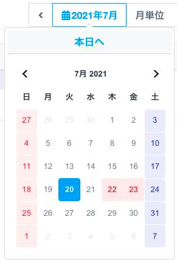

 
  
  
  
  

  
  
  

## 職務経歴

* this resume has been generated by [this script](make-history-git/run.sh)

### 代表的な個人開発のzenn

|  | タイトル | 工夫したポイント |
| :----: | --- | --- |
|  | [time stamper](https://zenn.dev/happy_elements/articles/483ec6759549b8) | タイムラインviewのデザイン 日本の祝日に対応したdate picker |  |
|  | [Hiker](https://zenn.dev/ryooo/articles/358a5ecf9219a6) | 本気の登山サポートGPSアプリ ルートデータ・POIデータ作成 事前に地理院地図と他者の歩行ルートデータをダウンロード可能 課金機能あり |
|  | [tocha](https://zenn.dev/ryooo/articles/b22576f62827b4) | GPT4リリース直後時点でスマホのSTT/TTSを使ったボイスインターフェースLLM |
|  | [Last will](https://zenn.dev/ryooo/articles/d34f296623a366) | Slackの未ログイン期間が設定を超えたら任意のメッセージを任意のチャンネルに通知するGitHub Actions 設定ファイルの暗号化 |

### Recent Activities

  
  

