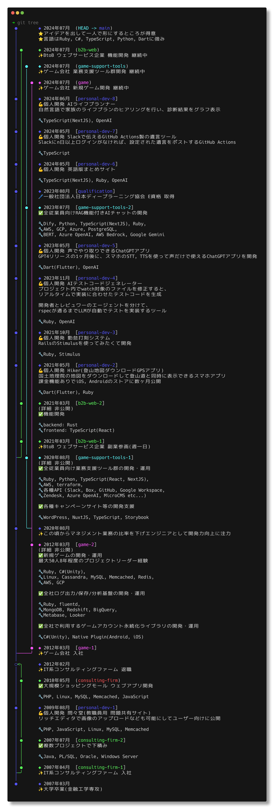
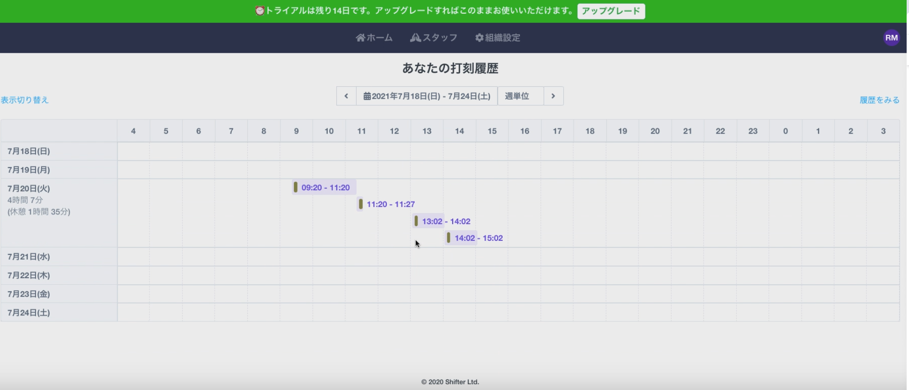
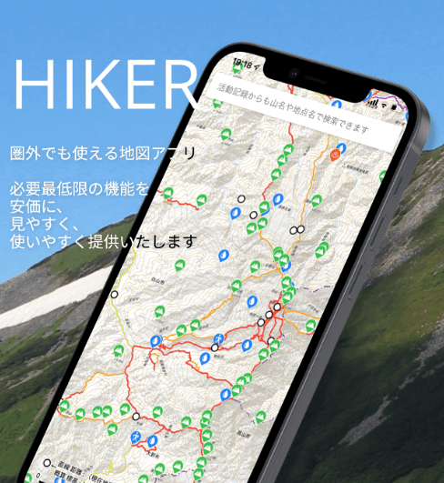
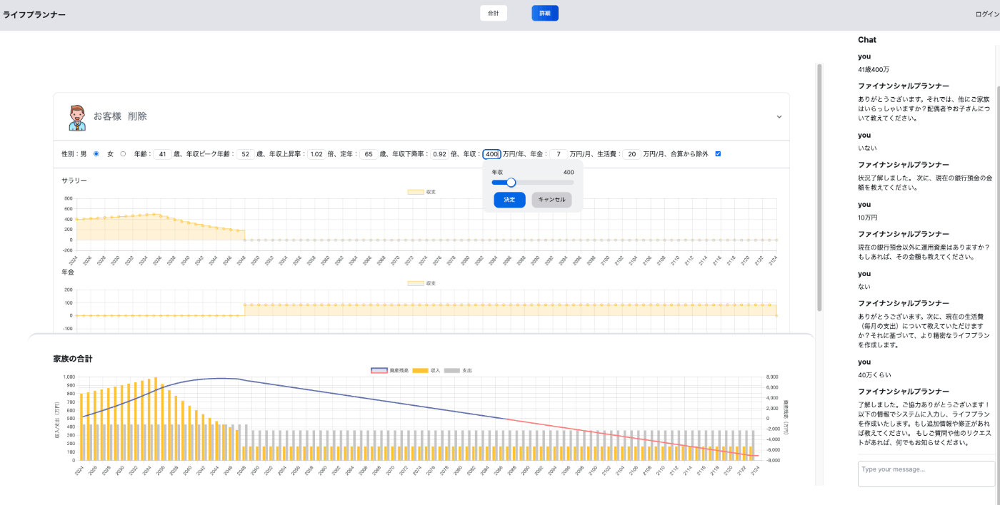

 
  
  
  
  

  
  
  

## 職務経歴

* 上図の作成方法は[こちらの記事](https://zenn.dev/ryooo/articles/15889cbf22220e)を参照ください

### zennに記事化した個人開発の制作物

|  | タイトル | 概要・工夫したポイント |
| :----: | --- | --- |
|  | [shifter](https://zenn.dev/happy_elements/articles/483ec6759549b8) | ・タイムラインviewのデザイン ・日本の祝日に対応したdate picker |  |
|  | [Hiker](https://zenn.dev/ryooo/articles/358a5ecf9219a6) | ・本気の登山サポートGPSアプリ ・ルートデータ・POIデータ作成ツール群 ・事前に地理院地図と他者の歩行ルートデータをダウンロード可能 ・サブスク課金 |
|  | [tocha](https://zenn.dev/ryooo/articles/b22576f62827b4) | ・GPT4リリース直後時点でスマホのSTT/TTSを使ったボイスインターフェースLLM |
|  | [Last will](https://zenn.dev/ryooo/articles/d34f296623a366) | ・Slackの未ログイン期間が設定を超えたら任意のメッセージを任意のチャンネルに通知するGitHub Actions ・設定ファイルの暗号化 |
|  | [Life planner](https://zenn.dev/ryooo/articles/6fb24bb132759f) | ・ChatGPTといっしょにライフプランを作る仕組み ・LLMでパラメーターを作成できるが、手動でもパラメーターを修正可能 |

# スキルセット
<table><tr><td valign="top" width="33%">

### 言語

  
  
  
  
  
   
  

  
  
  
  

</td><td valign="top" width="33%">

### フレームワーク・ツール等

  
  
  
  
  
  
  
  
  
  
  
  

  
  
  

</td><td valign="top" width="33%">

### DB・分析系

  

  
  
  
  
  
  
  
  
  
  
  
  

</td></tr>
<tr><td valign="top" width="33%">

### インフラ系

  

  
  
  
  
  

</td><td valign="top" width="33%">

### OS・CI

  

  
  

  
  

</td><td valign="top" width="33%">

### 機械学習系

  

  
  
  
  
  
  

</td></tr></table>

※ 業務での利用経験もしくはリリース済みの個人サービスでの採用経験を基準

### Recent Activities

  
  

